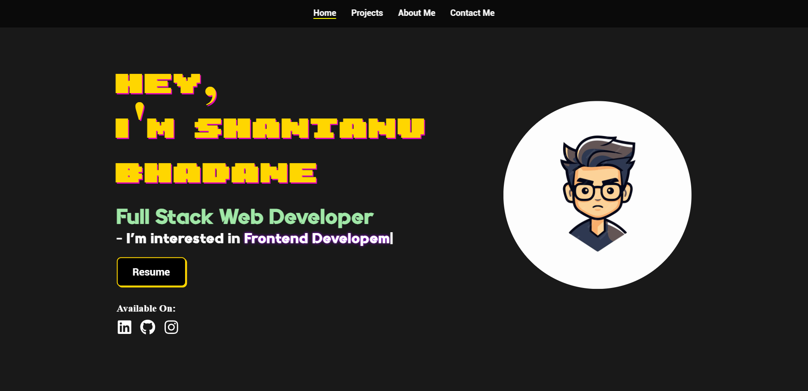

# My Portfolio

Welcome to my personal portfolio website! This repository contains the source code for my portfolio project, where I showcase my skills, projects, and experiences.




## Table of Contents
- [Overview](#overview)
- [Features](#features)
- [Tech Stack](#tech-stack)
- [Installation](#installation)


## Overview
This portfolio project is a personal website built with modern web development technologies. It features:
- A clean, responsive design that works on desktops, tablets, and mobile devices.
- A dedicated section to showcase Home,project, skills  and about us and qualification section.
- An interactive contact form that allows visitors to send me messages directly in my Mail.
- Smooth animations and hover effects to enhance user experience.

## Features
- **Responsive Design:** Adapts seamlessly to different screen sizes.
- **Interactive UI:** Includes hover animations, transitions, and a dynamic contact form.
- **Clean Layout:** Organized sections for easy navigation.
- **Modern Tech Stack:** Built using React, CSS, and JavaScript.
- **API Integration:** Contact form submission through API for real-time messaging.

## Tech Stack
- **React:** For building the user interface.
- **HTML5 & CSS3:** For structure and styling.
- **JavaScript:** For interactive elements.
- **React Hook Form:** For form validation and management.
- **APIs:** For handling contact form submissions.

## Installation
To run this project locally, follow these steps:

1. **Clone the repository:**
   ```bash
   git clone https://github.com/yourusername/portfolio.git

   cd portfolio

   npm i

   npm run dev
